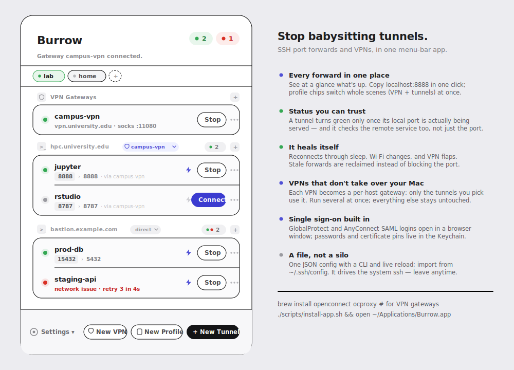

# Burrow

Burrow is a macOS SSH tunnel manager for people who keep too many terminal tabs open just to babysit port forwards — and too many VPN clients fighting over the routing table.

It keeps tunnel definitions in one config file, runs them with the system `ssh`, reconnects when sessions drop, and gives you a native menu-bar UI for the day-to-day work: see what is up, understand what is retrying, restart what failed, and get back to the thing you were actually doing. It can also supervise userspace VPN gateways (GlobalProtect, AnyConnect, …) as local SOCKS proxies, route individual tunnels through them, and never touch a routing table while doing it.

<p align="center">
  
</p>

## Highlights

- Native macOS menu-bar app with host-grouped tunnels, status dots, quick reconnect, edit, duplicate, and delete actions.
- VPN gateways: openconnect + ocproxy run AnyConnect/GlobalProtect/Pulse/Fortinet VPNs entirely in userspace as local SOCKS5 ports — no root, no tun device, no routing changes, multiple VPNs at once, friendly with Tailscale.
- Browser-based SAML sign-in for VPNs (embedded window for GlobalProtect, external browser for AnyConnect) plus one-click server certificate pinning.
- Per-host gateway dropdown in the menu: pick which VPN (or direct) each host's tunnels ride; running tunnels restart onto the new route.
- Open Chrome/Edge/Brave proxied through a gateway with one click, in an isolated profile — normal browsing stays off the VPN.
- Click a tunnel's port chip to copy `localhost:PORT`; row menu opens local forwards in the browser.
- Failed tunnels show a classified diagnosis and a live retry countdown ("network issue · retry 3 in 4s").
- Smart tunnel editor in its own window, with autofill from existing tunnels and `~/.ssh/config`, live local-port conflict warnings, and a gateway picker.
- Import tunnels from `~/.ssh/config` (LocalForward/RemoteForward/DynamicForward), and autodetect VPN servers from installed GlobalProtect/AnyConnect clients.
- One central JSON config at `~/Library/Application Support/Burrow/config.json`, watched live — CLI or hand edits appear without a reload.
- Generated ssh include file routes plain `ssh somehost` through the right gateway by host pattern.
- Start at Login option, auto-connect on launch, automatic reconnect, and stale-process reclamation for Burrow-owned forwards.
- Connection status only turns green after the launched SSH process owns the local listener, avoiding false positives from stale ports.
- Passwords (SSH and VPN) live in the macOS Keychain, saved only after a successful connection.
- No custom SSH or VPN stack: Burrow builds commands and supervises `/usr/bin/ssh` and `openconnect`.

## Install

One line — clones the source, builds the app, installs it to `~/Applications/Burrow.app`, and launches it (requires the Xcode Command Line Tools):

```bash
curl -fsSL https://raw.githubusercontent.com/jzthree/Burrow/main/scripts/install.sh | bash
```

Re-run the same line any time to update. Prefer doing it by hand?

```bash
git clone https://github.com/jzthree/Burrow.git && cd Burrow
./scripts/install-app.sh && open ~/Applications/Burrow.app
```

## Requirements

- macOS 13 or later, and the Xcode Command Line Tools to build (`xcode-select --install`).
- **Tunnels need nothing extra.** Burrow supervises the system `/usr/bin/ssh`; there are no runtime dependencies for the core app.
- **VPN gateways are optional** and use two open-source tools:
  - [`openconnect`](https://www.infradead.org/openconnect/) (LGPL-2.1) — speaks the AnyConnect, GlobalProtect, Pulse, and Fortinet protocols.
  - [`ocproxy`](https://github.com/cernekee/ocproxy) — turns the VPN session into a local SOCKS5 listener, so no tun device or root is needed.

  You don't have to install them up front: the first time you connect a gateway, Burrow offers to run `brew install openconnect ocproxy` in a Terminal window and connects automatically when it finishes. Burrow looks for the tools in `/opt/homebrew/bin`, `/usr/local/bin`, `/opt/local/bin`, and `/usr/bin`, or at paths set via `BURROW_OPENCONNECT` / `BURROW_OCPROXY`. Tunnels are unaffected either way.

## Quick Start

Build everything:

```bash
swift build
```

Create the shared config:

```bash
.build/debug/burrow init
```

Add a local forward:

```bash
.build/debug/burrow add \
  --name prod-db \
  --host bastion.example.com \
  --user alice \
  --identity ~/.ssh/id_ed25519 \
  --local 127.0.0.1:15432:127.0.0.1:5432
```

Run it from the terminal:

```bash
.build/debug/burrow run prod-db
```

Or run the menu-bar app:

```bash
.build/debug/BurrowApp
```

## Menu-Bar App

The app sits in the macOS top bar and focuses on operational tunnel work:

- `Connect` or `Stop` individual tunnels and VPN gateways; the bolt toggle controls auto-connect per tunnel.
- Pick a gateway per host from the dropdown chip on each host group, or per tunnel from the row menu.
- Click a port chip to copy `localhost:PORT`; the row menu copies addresses and opens local forwards in the browser.
- Failed rows replace the route with a diagnosis and live retry countdown; the route and full error stay one hover away.
- Let enabled tunnels keep retrying across VPN, DNS, or network changes; "Stop Retrying" is in the row menu when you want quiet.
- Inspect details, recent logs, and the generated SSH or openconnect command.
- Config changes from the CLI or an editor appear live — no manual reload needed.
- Settings menu: New VPN Gateway, Import from SSH Config, Copy SSH Config Include Line, Start at Login, Reload, Edit JSON, Quit.

## Tunnel Editor

The editor opens in its own window (it survives clicks outside the menu) and keeps the common path short:

- Visible by default: tunnel name, SSH host, user, SSH port, gateway, local port, destination host, and destination port.
- Hidden behind `Advanced SSH settings`: identity file, jump host, keepalive, reconnect delay, bind address, remote/dynamic forwarding, and raw SSH options.
- `Autofill` uses the host you entered to copy likely values from existing tunnels and from `~/.ssh/config`.
- Live warnings when the local port collides with another tunnel or an existing listener.
- New tunnels suggest the next unused local port and common destination ports such as `3000` or `8888`.

Install it as a stable app bundle:

```bash
./scripts/install-app.sh
open ~/Applications/Burrow.app
```

For best Keychain behavior, sign the app with a persistent Apple Development identity. The repo also includes an Xcode project for that workflow:

```bash
open Burrow.xcodeproj
```

## CLI Reference

```bash
burrow init
burrow list
burrow print-config
burrow sample-config
burrow add --name NAME --host HOST --local [bind:]local_port:dest_host:dest_port
burrow add --name NAME --host HOST --remote [bind:]remote_port:dest_host:dest_port
burrow add --name NAME --host HOST --dynamic [bind:]socks_port
burrow enable NAME
burrow disable NAME
burrow remove NAME
burrow run [--all|NAME]
```

Useful options for `burrow add`:

```bash
--user USER
--port SSH_PORT
--identity PATH
--jump JUMP_HOST
--server-alive-interval SECONDS
--server-alive-count-max COUNT
--reconnect-delay SECONDS
--ssh-option KEY=VALUE
--disabled
```

Forward syntax:

- Local: `[bind_address:]local_port:dest_host:dest_port`
- Remote: `[bind_address:]remote_port:dest_host:dest_port`
- Dynamic SOCKS: `[bind_address:]socks_port`

## VPN Gateways

Burrow can supervise userspace VPNs the same way it supervises tunnels. A gateway runs `openconnect` (AnyConnect, GlobalProtect, Pulse, Fortinet, …) with `ocproxy`, exposing the VPN as a local SOCKS5 port — no tun device, no root, no routing-table changes, so multiple gateways coexist with each other and with system VPNs like Tailscale.

```bash
brew install openconnect ocproxy
```

Create gateways from the menu-bar app (the `+` button in the VPN Gateways section, or Settings → New VPN Gateway…) or define them in the config:

```json
{
  "gateways": [
    {
      "name": "campus",
      "protocol": "gp",
      "server": "vpn.example.edu",
      "user": "alice",
      "socksPort": 11080,
      "authMode": "saml",
      "sshHostPatterns": ["*.example.edu", "172.18.*"]
    }
  ],
  "tunnels": [
    { "name": "hpc-jupyter", "gateway": "campus", "...": "..." }
  ]
}
```

- Tunnels with a `gateway` automatically get `ProxyCommand` via the gateway's SOCKS port; starting such a tunnel starts the gateway first and waits for it to come up (Duo-style approvals included).
- `authMode: "saml"` handles browser-based single sign-on: GlobalProtect logins open in an embedded sign-in window (Burrow captures the prelogin cookie for openconnect), AnyConnect uses openconnect's external-browser flow. Your IdP session persists between connects, so re-auth is usually instant.
- With `authMode: "password"`, VPN passwords live in the macOS Keychain, saved after the first successful connection.
- If openconnect rejects the server certificate (it uses its own CA bundle, not the macOS Keychain), Burrow shows the suggested `pin-sha256` fingerprint and offers Trust and Reconnect — the pin is saved to the gateway's extra arguments.
- `sshHostPatterns` (comma-separated, wildcards allowed) generates an ssh include file so plain `ssh somehost.example.edu` also routes through the gateway: Settings → "Copy SSH Config Include Line", paste into `~/.ssh/config` once.
- Each host group in the menu has a gateway dropdown; switching it re-routes and restarts that host's tunnels.
- The gateway's row menu can open Chrome/Edge/Brave through the VPN in an isolated browser profile (DNS included). Safari is excluded by design — it only honors the system-wide proxy, which Burrow never touches.
- The gateway editor autodetects servers from installed GlobalProtect and AnyConnect clients.
- Gateways appear in the menu with the same status/Connect/Stop controls as tunnels.

## Config

Burrow stores config as JSON so it can be edited by hand, generated by scripts, or managed through the UI.

```json
{
  "version": 1,
  "tunnels": [
    {
      "name": "prod-db",
      "host": "bastion.example.com",
      "user": "alice",
      "sshPort": 22,
      "identityFile": "~/.ssh/id_ed25519",
      "jumpHost": null,
      "enabled": true,
      "serverAliveInterval": 30,
      "serverAliveCountMax": 3,
      "reconnectDelaySeconds": 5,
      "extraSSHOptions": [],
      "forwards": [
        {
          "kind": "local",
          "bindAddress": "127.0.0.1",
          "listenPort": 15432,
          "destinationHost": "127.0.0.1",
          "destinationPort": 5432
        }
      ]
    }
  ]
}
```

You can override the config path for testing or alternate profiles:

```bash
BURROW_CONFIG=/path/to/config.json burrow list
```

## Architecture

Burrow is split into a shared Swift core and two thin frontends:

- `PortKeeperCore` owns config parsing, SSH command construction, stale process cleanup, local-forward readiness checks, and process supervision.
- `burrow` is the CLI entrypoint.
- `BurrowApp` is the SwiftUI menu-bar app.

That split keeps the CLI and UI behavior consistent: both use the same config model and SSH launch logic.
